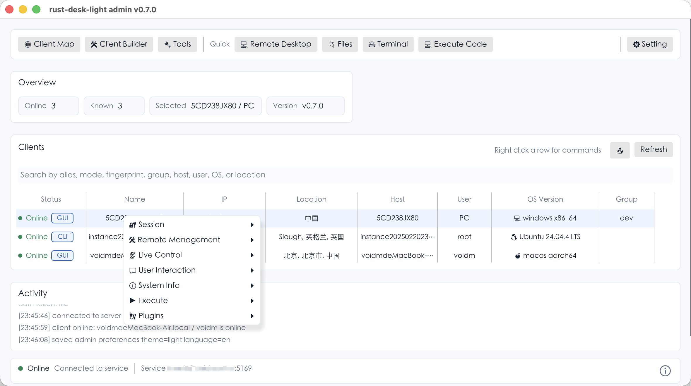
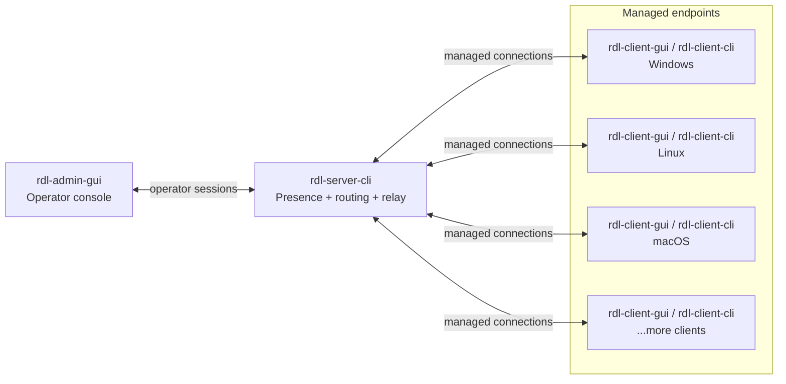

# rust-desk-light


`rust-desk-light` is a lightweight Rust remote assistance toolkit with a GUI operator console, a CLI relay server, GUI and CLI endpoint clients, and a compact binary protocol. It supports device discovery, command execution, remote terminal, file transfer, remote desktop, camera preview, audio listen, and duplex voice chat across Windows, Linux, and macOS.

> Intended for authorized remote assistance, lab administration, and development/testing environments. Current transport is not end-to-end encrypted; use trusted networks, VPNs, or other network-level protection for sensitive deployments.

## Overview

| Binary | Type | Purpose |
| --- | --- | --- |
| `rdl-admin-gui` | GUI | Operator console for online clients, command dispatch, live control, file transfer, and remote terminals. |
| `rdl-server-cli` | CLI | Relay server for peer registration, session tokens, presence, routing, and UDP audio relay. |
| `rdl-client-gui` | GUI | Full endpoint client with status window, live control, media capture, and terminal fallback. |
| `rdl-client-cli` | CLI | Terminal-only endpoint client built without GUI/live-control dependencies. |

Linux desktop control targets X11 tools such as `maim`, ImageMagick `import`, and `xdotool`. macOS remote control needs Accessibility permission for the app that launches `rdl-client-gui`, and screen capture may need Screen Recording permission.

## Screenshots




## Quick Start

Start the local development stack:

```sh
./scripts/start-dev.sh
```

Windows:

```powershell
.\scripts\start-dev.bat
```

Manual local run:

```sh
./target/debug/rdl-server-cli --ip 0.0.0.0 --port 5169
./target/debug/rdl-client-gui --ip 127.0.0.1 --port 5169
./target/debug/rdl-admin-gui --ip 127.0.0.1 --port 5169
```

Start the server first, then clients, then admin.

## Build

Requires Rust stable and Git.

```sh
rustup update stable
cargo check --workspace
cargo build --workspace
cargo build --workspace --release
```

Build the no-GUI client:

```sh
cargo build-client-cli --release
```

Individual build aliases:

```sh
cargo build-server-cli --release
cargo build-client-gui --release
cargo build-client-cli --release
cargo build-admin-gui --release
```

Debug binaries go to `target/debug`; release binaries go to `target/release`. Windows adds `.exe`.

## Configuration

Config files are created automatically on first run:
`~/.config/rust-desk-light/` on macOS/Linux, `%APPDATA%\rust-desk-light\` on
Windows. The files in `config/` are templates.

```sh
mkdir -p ~/.config/rust-desk-light
cp config/server.template.toml ~/.config/rust-desk-light/server.toml
cp config/client.template.toml ~/.config/rust-desk-light/client.toml
cp config/admin.template.toml ~/.config/rust-desk-light/admin.toml
```

Use `--config PATH` for repo-local or custom config files. Startup arguments
override config files. Client binaries generated by the admin Client Builder can
also carry an embedded read-only config in the client executable itself; that
embedded client config has the highest priority and overrides startup arguments.

Auth uses one shared token across server, admin, and optionally clients. The
admin must present the token before it can register. If `rdl-server-cli` starts
without `--auth-token` or `RDL_AUTH_TOKEN`, it generates a token and prints it
once at startup. Clients only need the token when the server is started with
`--require-client-auth` or `[auth].require_client_auth = true`.

```sh
rdl-server-cli --auth-token "change-me"
rdl-server-cli --require-client-auth --auth-token "change-me"
rdl-admin-gui --auth-token "change-me"
rdl-client-gui --auth-token "change-me"
```

Useful environment variables:

| Variable | Purpose |
| --- | --- |
| `RDL_IP` | Default IP used by helper scripts. |
| `RDL_PORT` | Default port used by helper scripts. |
| `RDL_AUTH_TOKEN` | Shared registration token for server/admin/client. |
| `RDL_GEOIP_DB` | Path to a MaxMind GeoLite2/GeoIP2 City database. |
| `RDL_BUILD_VERSION` | Overrides the displayed build version. |

## Capabilities

| Area | Capabilities |
| --- | --- |
| Device operations | Online client list, search/filter, host metadata, heartbeat/reconnect, offline cleanup. |
| Remote management | File manager, directory transfer, remote terminal, process/window/startup/driver managers, registry snapshot, event log, active connections, performance monitor. |
| Live control | Remote desktop, mouse/keyboard input, camera preview, audio listen, duplex voice chat. |
| User interaction | Message box, system notification, text chat, open text in the platform editor. |
| System tools | Computer information, clipboard read/write, execute file, execute code, static commands, task creation, command presets. |

## Architecture



The server is intentionally thin. It validates the shared registration token,
issues per-connection session tokens, keeps a presence table, and routes typed
messages between admins and clients. Endpoint actions run on clients, not on the
relay.

## Transport

The configured server address uses the same numeric port for TCP and UDP. If you run across machines, allow both protocols on that port.

| Capability | Direction | Transport | Message format |
| --- | --- | --- | --- |
| Registration, session token, heartbeat, client list | Admin/Client <-> Server | TCP | `RDL1` framed binary messages |
| Commands, acknowledgements, command output, remote terminal | Admin -> Server -> Client, then results back | TCP | `Command`, `CommandAck`, `CommandOutput` |
| File manager and file transfer | Admin <-> Server <-> Client | TCP | `FileTransfer` messages |
| Remote desktop and camera preview | Client -> Server -> Admin | TCP | `VideoControl`, `VideoFrame`, `DesktopInput` |
| Audio listen and duplex voice chat | Admin/Client <-> Server | UDP | `RDU1` `pcm_s16le` packets |

Reliable work stays on framed TCP messages; interactive audio uses small low-latency UDP packets so voice does not queue behind bulk traffic.

## Client Map

The admin map uses a MaxMind GeoLite2/GeoIP2 City database when configured:

```sh
./target/release/rdl-server-cli --ip 0.0.0.0 --port 5169 --geoip-db /path/GeoLite2-City.mmdb
```

The startup scripts also auto-detect `third_party/geoip/GeoLite2-City.mmdb`. See [GeoLite2 City setup](docs/geolite2-city-setup.md).

## Release Builds

Tagged releases are built by GitHub Actions from `.github/workflows/release.yml`.

Each release package contains:

```text
rdl-server-cli
rdl-client-gui
rdl-client-cli
rdl-admin-gui
README.md
```

`rdl-client-cli` is built without GUI dependencies for terminal-only deployments.

On macOS, clear quarantine metadata after extracting a downloaded archive if needed:

```sh
xattr -cr ./rdl-client-gui
xattr -cr ./rdl-admin-gui
xattr -cr ./rdl-server-cli
```

## Version Info

```sh
rdl-server-cli --version
rdl-client-gui --version
rdl-client-cli --version
rdl-admin-gui --version
```

Tagged builds use the git tag; local builds use the workspace version unless `RDL_BUILD_VERSION` is set.

## Client Builder

`rdl-admin-gui` includes a Client Builder button in the top toolbar. Select a
fresh `rdl-client-gui` template binary, choose an output path, set the server
IP/port and optional auth token, then generate a configured client. The builder
writes the TOML config into a fixed read-only config slot compiled into the
client binary, so the generated client can be double-clicked without a separate
client config file. On macOS, the generated binary is ad-hoc signed after the
slot is written. When an embedded config is present, the client does not load,
create, or update `client.toml`; runtime identity and lock files may still be
written under the normal rust-desk-light config directory.

Use a client binary built after this feature as the template. Older client
binaries do not contain the embedded config slot and will be rejected.

## Project Notes

- The main transport is a custom versioned binary protocol with `RDL1` framed messages.
- Audio listen and voice chat use a separate `RDU1` packet format with stream ids, sequence numbers, capture timestamps, sample rate, channel count, and PCM payloads.
- Linux remote desktop testing details live in [Ubuntu X11 remote desktop testing](docs/ubuntu-x11-remote-desktop-testing.md).
- Current milestones and planned work live in [ROADMAP.md](ROADMAP.md).

## Powered by

[](https://jb.gg/OpenSource)

## License

This project is licensed under the Apache License 2.0.
