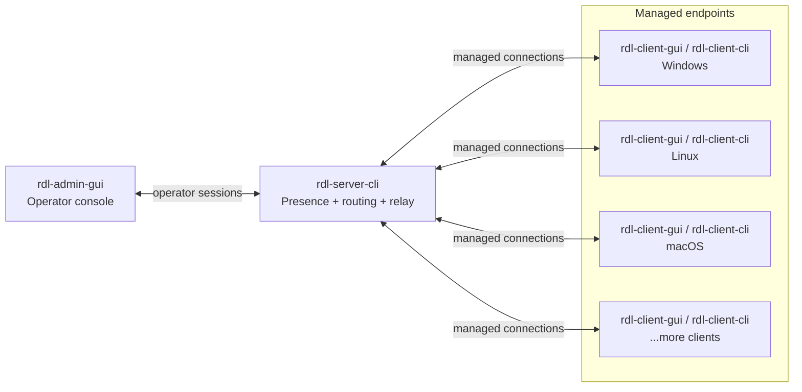

# Rust Desk Light - Remote Administration Tool (RAT)


**rust-desk-light** is a lightweight Rust **remote administration tool (RAT)**. It packs a GUI operator console, a CLI relay server, GUI & CLI endpoint clients, and a compact binary protocol. The toolkit supports device discovery, **remote management**, file transfer, remote desktop, camera preview, audio listening, and duplex voice chat – all running smoothly on Windows, Linux, and macOS.

> Intended for authorized remote assistance, lab administration, and
> development/testing environments. Current transport is not end-to-end
> encrypted; use trusted networks, VPNs, or other network-level protection for
> sensitive deployments.

## Overview

| Binary | Type | Purpose |
| --- | --- | --- |
| `rdl-admin-gui` | GUI | Client control console. |
| `rdl-server-cli` | CLI | Session and traffic relay. |
| `rdl-client-gui` | GUI | Graphical endpoint client. |
| `rdl-client-cli` | CLI | Headless endpoint client. |

Linux desktop control targets X11 tools such as `maim`, ImageMagick `import`,
and `xdotool`. macOS remote control needs Accessibility permission for the app
that launches the client, and screen capture may need Screen Recording
permission.

## Features

| Area | Features |
| --- | --- |
| Device management | Online list, search, host info, reconnects, and cleanup. |
| Remote management | Files, directories, terminal, processes, windows, startup, and drivers. |
| System diagnostics | Registry, event logs, connections, performance, and computer info. |
| Live control | Remote desktop, input, camera, audio, and two-way voice. |
| Interaction tools | Messages, notifications, chat, clipboard, execution, and presets. |
| Admin utilities | Client Builder and GeoIP-backed client map. |

## Screenshots


## Quick Start

Start the local development stack:

```sh
./scripts/start-dev.sh --release
```

Windows:

```powershell
.\scripts\start-dev.bat --release
```

For a manual local run, start the server first, then clients, then admin:

```sh
./target/release/rdl-server-cli --ip 0.0.0.0 --port 5169
./target/release/rdl-client-gui --ip 127.0.0.1 --port 5169
./target/release/rdl-admin-gui --ip 127.0.0.1 --port 5169
```

## Download

Prebuilt release packages are available on the
[GitHub Releases page](https://github.com/marlkiller/rust-desk-light/releases).

## Build

Requires Rust stable and Git.

```sh
rustup update stable
cargo check --workspace
cargo build --workspace
cargo build --workspace --release
```


Individual build aliases:

```sh
cargo build-server-cli --release
cargo build-client-gui --release
cargo build-client-cli --release
cargo build-admin-gui --release
```

Use `--profile release-size` for a smaller `rdl-client-cli` when needed.

Debug binaries go to `target/debug`; release binaries go to `target/release`.
Windows adds `.exe`.

On macOS, clear quarantine metadata if you run binaries extracted from a
downloaded archive:

```sh
xattr -cr ./rdl-client-gui
xattr -cr ./rdl-admin-gui
xattr -cr ./rdl-server-cli
```

## Local App Packages

Use the local packaging scripts to wrap the standalone GUI binaries as
system-native app packages for the client and admin console. The packaged apps
launch without a terminal window and are written to `dist/apps/<platform>/`.

Windows:

```powershell
.\scripts\package-apps.ps1 --release
```

macOS/Linux:

```sh
./scripts/package-apps.sh --release
```

The scripts build `rdl-client-gui` and `rdl-admin-gui`, package them separately,
and include the application icon, config templates, and a short README. macOS
packages are `.app` bundles; Linux packages are AppDir style directories with
`.desktop` metadata and icons.

`rdl-client-cli` is not included in these app packages because it does not ship a
local graphical UI. Build it separately with `cargo build-client-cli --release`
when you need the command-line endpoint.

## Configuration

Config files are created automatically on first run:
`~/.config/rust-desk-light/` on macOS/Linux, `%APPDATA%\rust-desk-light\` on
Windows. The files in `config/` are templates.

```sh
mkdir -p ~/.config/rust-desk-light
cp config/server.template.toml ~/.config/rust-desk-light/server.toml
cp config/client.template.toml ~/.config/rust-desk-light/client.toml
cp config/admin.template.toml ~/.config/rust-desk-light/admin.toml
```

Use `--config PATH` for repo-local or custom config files. Startup arguments
override config files. Client binaries generated by the admin Client Builder can
also carry an embedded read-only config in the client executable itself; that
embedded client config has the highest priority and overrides startup arguments.
Use a freshly built `rdl-client-gui` as the Client Builder template; older
binaries without the embedded config slot are rejected.

Auth uses one shared token across server, admin, and optionally clients. The
admin must present the token before it can register. If `rdl-server-cli` starts
without `--auth-token` or `RDL_AUTH_TOKEN`, it generates a token and prints it
once at startup. Clients only need the token when the server is started with
`--require-client-auth` or `[auth].require_client_auth = true`.

```sh
rdl-server-cli --auth-token "change-me"
rdl-server-cli --require-client-auth --auth-token "change-me"
rdl-admin-gui --auth-token "change-me"
rdl-client-gui --auth-token "change-me"
```

To enable the admin client map, pass a MaxMind GeoLite2/GeoIP2 City database to
the server:

```sh
./target/release/rdl-server-cli --ip 0.0.0.0 --port 5169 --geoip-db /path/GeoLite2-City.mmdb
```

The startup scripts also auto-detect `third_party/geoip/GeoLite2-City.mmdb`.
See [GeoLite2 City setup](docs/geolite2-city-setup.md).

Useful environment variables:

| Variable | Purpose |
| --- | --- |
| `RDL_IP` | Default IP used by helper scripts. |
| `RDL_PORT` | Default port used by helper scripts. |
| `RDL_AUTH_TOKEN` | Shared registration token for server/admin/client. |
| `RDL_GEOIP_DB` | Path to a MaxMind GeoLite2/GeoIP2 City database. |
| `RDL_BUILD_VERSION` | Overrides the displayed build version. |

## Architecture



The server is intentionally thin. It validates the shared registration token,
issues per-connection session tokens, keeps a presence table, and routes typed
messages between admins and clients. Endpoint actions run on clients, not on the
relay.

## Transport

The configured server address uses the same numeric port for TCP and UDP. If you
run across machines, allow both protocols on that port.

| Capability | Direction | Transport | Message format |
| --- | --- | --- | --- |
| Registration, session token, heartbeat, client list | Admin/Client <-> Server | TCP | `RDL1` framed binary messages |
| Commands, acknowledgements, command output, remote terminal | Admin -> Server -> Client, then results back | TCP | `Command`, `CommandAck`, `CommandOutput` |
| File manager and file transfer | Admin <-> Server <-> Client | TCP | `FileTransfer` messages |
| Remote desktop and camera preview | Client -> Server -> Admin | TCP | `VideoControl`, `VideoFrame`, `DesktopInput` |
| Audio listen and duplex voice chat | Admin/Client <-> Server | UDP | `RDU1` `pcm_s16le` packets |

Reliable work stays on framed TCP messages; interactive audio uses small
low-latency UDP packets so voice does not queue behind bulk traffic.

## Project Notes

- The main transport is a custom versioned binary protocol with `RDL1` framed
  messages.
- Audio listen and voice chat use a separate `RDU1` packet format with stream
  ids, sequence numbers, capture timestamps, sample rate, channel count, and PCM
  payloads.
- Linux remote desktop testing details live in
  [Ubuntu X11 remote desktop testing](docs/ubuntu-x11-remote-desktop-testing.md).
- Current milestones and planned work live in [ROADMAP.md](ROADMAP.md).

## Powered by

[](https://jb.gg/OpenSource)

## License

This project is licensed under the Apache License 2.0.
