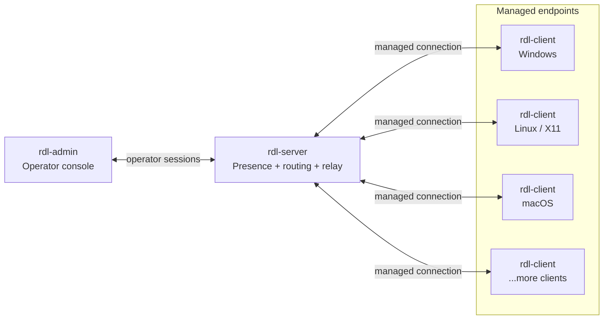
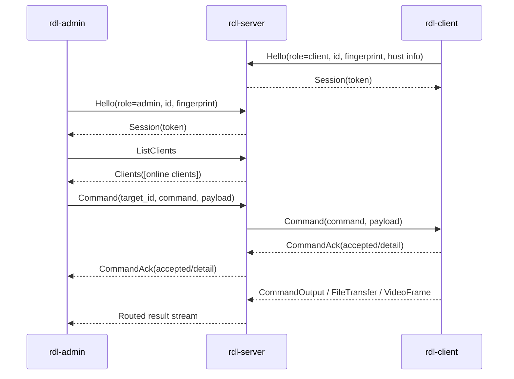

# rust-desk-light


Lightweight Rust remote assistance toolkit with an operator console, relay server, endpoint client, and a shared binary protocol. It supports device discovery, command execution, remote terminal, file transfer, remote desktop, camera preview, audio listen, and duplex voice chat across Windows, Linux, and macOS.

> Intended for authorized remote assistance, lab administration, and development/testing environments. Current transport is not end-to-end encrypted; use trusted networks, VPNs, or other network-level protection for sensitive deployments.

## Overview

`rust-desk-light` is organized around three runtime components:

| Component | Role | Notes |
| --- | --- | --- |
| `rdl-admin` | Operator GUI | Lists online clients, sends commands, opens live control/file/terminal windows, and receives results. |
| `rdl-server` | Relay and presence hub | Registers peers, issues session tokens, tracks online clients, and routes traffic between admins and clients. |
| `rdl-client` | Endpoint agent | Runs on managed machines, reports host metadata, executes approved command handlers, captures media, and serves file/terminal requests. |

## Architecture



The server is intentionally thin. It does not execute endpoint actions itself; it authenticates registered peers with server-issued session tokens, keeps a presence table, and routes typed messages between admins and clients.

## Control Flow



## Feature Paths

The configured server address uses the same numeric port for TCP and UDP. If you run across machines, allow both protocols on that port.

| Capability | Direction | Transport | Message format |
| --- | --- | --- | --- |
| Registration, session token, heartbeat, client list | Admin/Client <-> Server | TCP | `RDL1` framed binary messages |
| Commands, acknowledgements, command output, remote terminal | Admin -> Server -> Client, then results back | TCP | `Command`, `CommandAck`, `CommandOutput` |
| File manager and file transfer | Admin <-> Server <-> Client | TCP | `FileTransfer` start/directory/chunk/progress/complete/error |
| Remote desktop and input | Admin <-> Server <-> Client | TCP | `VideoControl`, `VideoFrame`, `DesktopInput` |
| Camera preview | Client -> Server -> Admin | TCP | `VideoControl`, `VideoFrame` |
| Audio listen | Client -> Server -> Admin | UDP | `RDU1` `pcm_s16le` packets |
| Duplex voice chat | Admin <-> Server <-> Client | UDP | Two `RDU1` audio streams, one per direction |

Reliable work stays on framed messages; interactive audio uses small low-latency packets so voice does not queue behind bulk traffic.

## Feature Set

| Area | Capabilities |
| --- | --- |
| Device operations | Online client list, search/filter, host metadata, session token validation, heartbeat/reconnect, offline cleanup. |
| Remote management | File manager, upload/download, directory transfer, delete/rename/new folder, remote terminal, process/window/startup/driver managers, registry snapshot, event log, active connections, performance monitor. |
| Live control | Remote desktop viewing, mouse movement/clicks, text keyboard input, camera preview, audio listen, duplex voice chat. |
| User interaction | Message box, system notification, text chat, open text in the platform editor. |
| System tools | Computer information, clipboard read/write, execute file, execute code, reusable static commands, task creation, command presets. |
| Operator UI | GUI console, activity log, rich result windows, terminal-mode smoke testing fallback. |

## Supported Platforms

| Binary | Windows | Linux | macOS | Notes |
| --- | --- | --- | --- | --- |
| `rdl-server` | Yes | Yes | Yes | Terminal relay server. |
| `rdl-client` | Yes | Yes | Yes | GUI client with terminal fallback via `RDL_FORCE_TERMINAL=1`. |
| `rdl-admin` | Yes | Yes | Yes | GUI admin console with terminal mode for smoke tests. |

Platform-specific capability notes:

- Windows: desktop capture uses native GDI; camera uses Media Foundation through `nokhwa`; audio capture/playback uses `cpal`; input uses Windows APIs and PowerShell text input.
- Linux: desktop capture currently targets X11 through `maim` or ImageMagick `import`; audio capture/playback uses `cpal`; mouse input uses `xdotool`; Wayland needs a portal/ydotool backend later.
- macOS: desktop capture uses `screencapture`; audio capture/playback uses `cpal`; mouse input uses Core Graphics and requires Accessibility permission for the process that launches `rdl-client`; screen capture may require Screen Recording permission.
- macOS debug/release binaries can be ad-hoc signed. Production Developer ID signing and notarization are future work.

## Repository Layout

```text
crates/
  admin/      Operator console and command windows
  server/     Presence hub, traffic router, and audio relay
  client/     Endpoint GUI, command handlers, live capture, file/terminal services
  protocol/   Shared wire protocol and command model
  assets/     Embedded icons and shared UI assets
  version/    Build/version metadata
scripts/      Local dev, smoke test, and release helper scripts
docs/         Platform-specific testing notes
```

## Requirements

- Rust stable toolchain, installed with `rustup`.
- Git.
- Windows, Linux, or macOS.

Linux remote desktop testing may also require desktop tools such as `maim`, ImageMagick `import`, `xdotool`, and X11 utilities. See [Ubuntu X11 remote desktop testing](docs/ubuntu-x11-remote-desktop-testing.md).

Install or update Rust:

```sh
rustup update stable
rustup default stable
```

Check the toolchain:

```sh
rustc --version
cargo --version
```

## Build

Download crate dependencies:

```sh
cargo fetch
```

Check the workspace:

```sh
cargo check --workspace
```

Build debug binaries:

```sh
cargo build --workspace
```

Build release binaries:

```sh
cargo build --workspace --release
```

Debug binaries are written to `target/debug`; release binaries are written to `target/release`. Windows builds use the `.exe` suffix.

## Run Built Binaries

After `cargo build --workspace`, start the debug binaries directly:

```sh
./target/debug/rdl-server --ip 0.0.0.0 --port 5169
./target/debug/rdl-client --ip 127.0.0.1 --port 5169
./target/debug/rdl-admin --ip 127.0.0.1 --port 5169
```

After `cargo build --workspace --release`, start the optimized release binaries directly:

```sh
./target/release/rdl-server --ip 0.0.0.0 --port 5169
./target/release/rdl-client --ip 127.0.0.1 --port 5169
./target/release/rdl-admin --ip 127.0.0.1 --port 5169
```

On Windows PowerShell, use the `.exe` files:

```powershell
.\target\release\rdl-server.exe --ip 0.0.0.0 --port 5169
.\target\release\rdl-client.exe --ip 127.0.0.1 --port 5169
.\target\release\rdl-admin.exe --ip 127.0.0.1 --port 5169
```

Start order is normally server first, then one or more clients, then the admin console. For cross-machine deployments, open the configured server port as described in [Feature Paths](#feature-paths).

## Configuration

Config files are initialized automatically on startup if missing. Default paths:

```text
Windows: %APPDATA%\rust-desk-light\<admin|client|server>.toml
Linux/macOS: $XDG_CONFIG_HOME/rust-desk-light/<admin|client|server>.toml, or ~/.config/rust-desk-light/<admin|client|server>.toml
```

Priority: built-in defaults < config file < startup arguments. `--ip` and `--port` always win for the current process.

Use `--config` for an explicit path:

```sh
rdl-server --config config/server.toml
rdl-client --config config/client.toml
rdl-admin --config config/admin.toml
```

Admin/client use `[server]`; server uses `[listen]`:

```toml
[server]
ip = "127.0.0.1"
port = 5169
```

Admin can update client config from `Session -> Client Config`, or in terminal mode:

```text
cmd <client-id> client_config confirm=true ip=127.0.0.1 port=5169 reconnect=true
```

If a client was launched with `--ip` or `--port`, remote updates still write the file, but startup arguments remain effective until restart without them.

## Quick Start

Launch the local development stack. This starts the server, client, and admin GUI for manual testing:

```sh
./scripts/start-dev.sh
```

On Windows:

```powershell
.\scripts\start-dev.bat
```

Run the server manually:

```sh
cargo run -p rust-desk-light-server -- --ip 0.0.0.0 --port 5169
```

Run a client:

```sh
cargo run -p rust-desk-light-client -- --ip 127.0.0.1 --port 5169
```

Run the admin GUI:

```sh
cargo run -p rust-desk-light-admin -- --ip 127.0.0.1 --port 5169
```

For release-mode manual testing, put Cargo flags before the `--` separator and app flags after it:

```sh
cargo run --release -p rust-desk-light-admin -- --ip 127.0.0.1 --port 5169
```

Useful environment variables:

```sh
RDL_IP=127.0.0.1
RDL_PORT=5169
RDL_FORCE_TERMINAL=1
```

In the admin GUI, select an online client, right-click the client row, and choose a command from the menu.

## Client Map

The admin GUI includes a client map view. It is populated by the server from
the connecting client IP address when a MaxMind GeoLite2/GeoIP2 City database is
configured:

```sh
./target/release/rdl-server --ip 0.0.0.0 --port 5169 --geoip-db /path/GeoLite2-City.mmdb
```

You can also set:

```sh
RDL_GEOIP_DB=/path/GeoLite2-City.mmdb
```

The shell startup scripts also auto-detect a bundled database at
`third_party/geoip/GeoLite2-City.mmdb` and start the server with it.

IP geolocation is approximate and should be treated as country/region/city-level
context. It is not precise enough to identify a street address, household, or
individual. Private LAN, loopback, VPN, proxy, and relay addresses may have no
location or a location that represents the network endpoint rather than the
physical client.

See [GeoLite2 City setup](docs/geolite2-city-setup.md) for download, extraction,
server deployment, and troubleshooting notes.

## Smoke Test

Run the automated local smoke flow. It uses terminal mode so CI and local shells can drive the protocol without opening GUI windows:

```sh
./scripts/smoke-test.sh
```

On Windows PowerShell:

```powershell
.\scripts\smoke-test.bat
```

## Version Info

All three binaries expose the build version:

```sh
rdl-server --version
rdl-client --version
rdl-admin --version
```

Tagged builds use the exact current git tag, for example `v0.1.0`. Untagged local builds fall back to the workspace package version from `Cargo.toml`. `RDL_BUILD_VERSION` can be set by CI to override the displayed version explicitly.

## Release Builds

Tagged releases are built by GitHub Actions from `.github/workflows/release.yml`.

Pushing a tag like `v0.1.0` creates platform artifacts for:

- Linux x64
- macOS x64
- macOS ARM64
- Windows x64

Each release package contains `rdl-server`, `rdl-client`, `rdl-admin`, and `README.md`. Rust release builds are native binaries, so there is no separate runtime/no-runtime split.

On macOS, if a downloaded release binary is blocked by quarantine metadata, clear it after extracting the archive:

```sh
xattr -cr ./rdl-client
xattr -cr ./rdl-admin
xattr -cr ./rdl-server
```

## Design Notes

- The main transport is a custom versioned binary protocol. Frames use `RDL1` magic bytes, protocol version, length, role, message kind, session token, and typed payloads.
- Client and admin peers register first, then the server issues a session token required by follow-up messages.
- Audio listen and voice chat use a separate `RDU1` packet format with stream ids, sequence numbers, capture timestamps, sample rate, channel count, and PCM payloads.
- Command result compatibility paths remain text-based where appropriate.

## Roadmap

See [ROADMAP.md](ROADMAP.md) for current milestones and planned work.

## License

This project is licensed under the Apache License 2.0.
